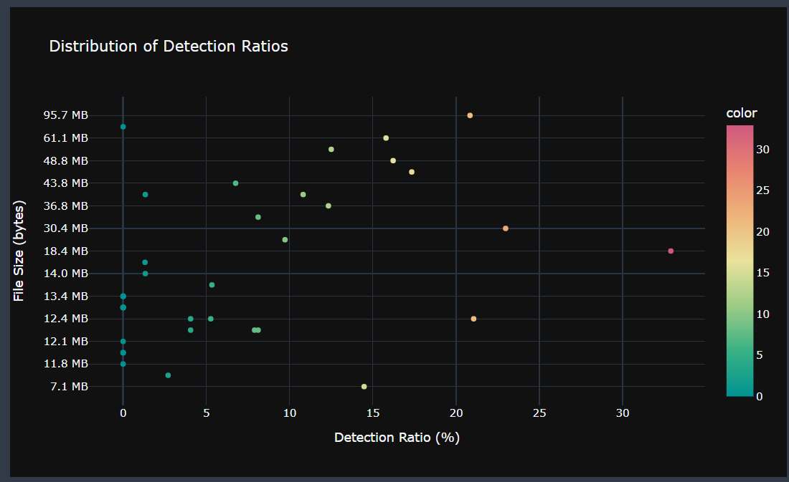
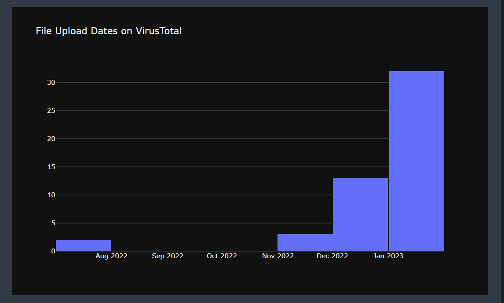
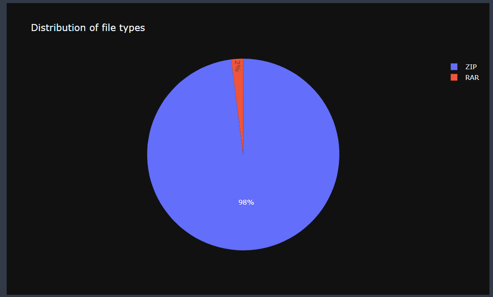

# RetrohuntStats
Visualizing VirusTotal retrohunting data with Jupyter notebook and plotly
*This Jupyter notebook uses VirusTotal's API to perform data visualization of SHA256 hashes*

## Dependencies
- VirusTotal API key
- plotly
- ipywidgets
- tqdm
- humanize

### Demo 
User Input:

